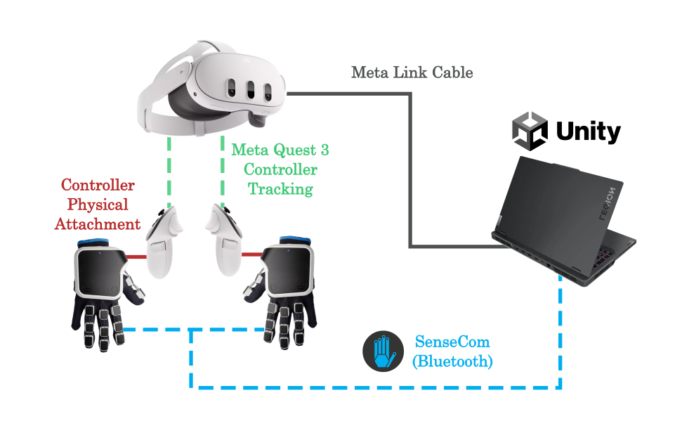
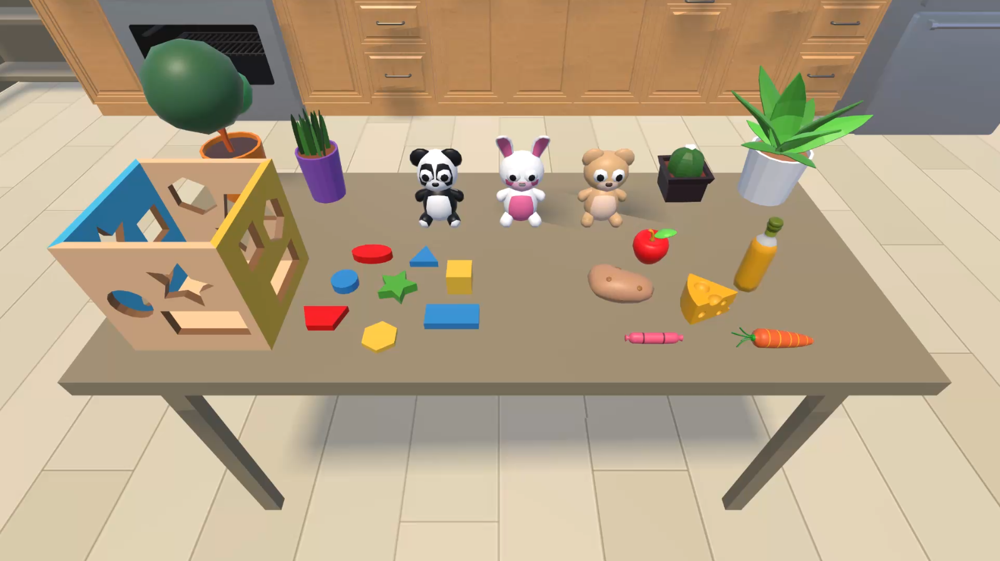
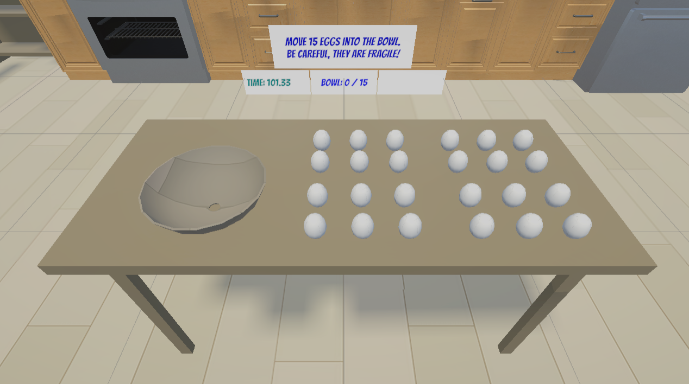
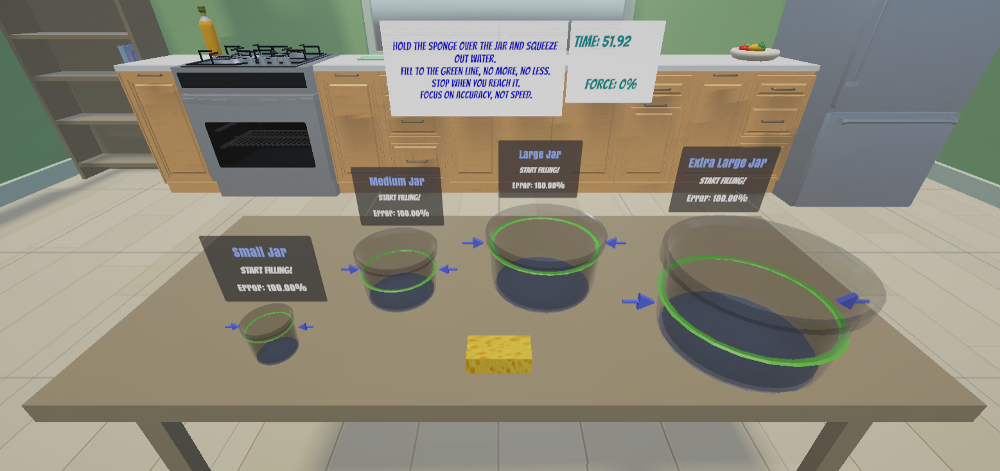

# Haptic Embodiment in VR
**Effects of vibrotactile and force feedback on sense of embodiment in virtual reality**

A research-driven Unity application built for **Meta Quest 3** and **SenseGlove Nova 2** force-feedback gloves, developed as part of an MSc Robotics thesis at Aalborg University (8th Semester).

The project runs a controlled within-subjects experiment across four haptic feedback conditions — no feedback, force only, vibrotactile only, and combined — to measure how each modality affects a user's sense of ownership and agency over a virtual hand. If you are building something with the Quest 3 or SenseGlove Nova 2, this repo includes working examples of force resistance tuning, dynamic vibrotactile scaling, multi-scene test management, and proprioceptive drift measurement.

---

## Stack

| | |
|---|---|
| **Engine** | Unity |
| **HMD** | Meta Quest 3 · [Getting started with Meta XR in Unity](https://developers.meta.com/horizon/documentation/unity/unity-tutorial-hello-vr/) |
| **Haptics** | SenseGlove Nova 2 (force feedback, vibrotactile, finger tracking) · [Getting started with SenseGlove in Unity](https://unity.docs.senseglove.com/GettingStarted/tutorials.html) |



---

## What is implemented

### Force feedback profiles (`SG_Material`)
Two distinct force response curves are tuned for different object types. The egg/familiarization objects ramp steeply to 95% of maximum braking force at around 15 mm of finger penetration, giving a firm, pressure-clear feel. The sponge uses a softer curve that peaks at ~70% around 28 mm, making it perceptually distinct and yielding. Both are deliberately shaped to avoid the flat SDK default, which feels abrupt and unrealistic.

### Dynamic vibrotactile feedback
A custom script drives continuous vibration to the index fingertip and thumb during object contact. Both amplitude and frequency scale in real time with the squeeze level read from the glove's brake sensors — so the tactile sensation grows in parallel with the increasing resistance force, keeping both channels consistent with each other.

### TestingManager
A persistent manager that survives scene loads for the duration of the session. It renders a control panel on the laptop screen (not inside the headset) so the test conductor can switch between the four feedback conditions and load any scene with a single button press — no Unity restart needed. Every interactable object registers itself with the manager on scene load and receives mode changes instantly.

### Proprioceptive drift measurement (`IndexPalmDistance`)
A 15 cm x-axis offset is silently applied to the virtual right hand after calibration. A script tracks the X-axis distance between a left index fingertip marker and a right palm marker every frame, smoothed over a 3-second rolling average. A real-time graph on the laptop screen plots both the raw and averaged values so the conductor can take a stable reading. This is used to quantify how much the participant's perceived hand position drifts toward the virtual hand over the course of a trial.

---

## Scenes

**Calibration** — SenseGlove SDK CalibrationVoid scene, run at the start of every trial. Maps the Nova 2 sensors to each participant's specific hand geometry across four steps: thumbs up, thumb below ring finger, thumb abduction, and hands together.

**Familiarization** — One minute of free exploration with a set of everyday objects (shape-sorting toys, food, plants, plush toys) before any data is recorded. Gives participants time to get used to the gloves and haptic response without the pressure of a task.



**Egg Task** — The participant transfers 15 fragile eggs from a table into a bowl without breaking them. Squeezing too hard — past a tuned yield distance of 25 mm with at least two fingers — cracks the egg and triggers a shell fragment break animation, a crack sound effect, and a full-hand haptic burst waveform. A HUD displays the live bowl count and broken egg tally. Completion time is recorded automatically.



**Sponge Task** — The participant squeezes a sponge above four jars of increasing size to fill each one to a green target line. The sponge mesh deforms visually in real time using `SG_MeshDeform`. Water particle emission rate, sound volume, and vibrotactile intensity all increase together as the participant squeezes harder. Fill accuracy per jar is recorded as percentage error from the target level.




---

## Project structure

```
Assets/
├── _Project/                  ← All original code and assets
│   ├── Scripts/
│   │   ├── Core/              ← IHapticTarget interface, HapticMode enum
│   │   ├── Haptics/           ← Glove reader, per-object haptic targets
│   │   ├── Interaction/       ← EggCounter, SpongeInteraction
│   │   ├── Diagnostics/       ← IndexPalmDistance, drift GUI
│   │   └── Testing/           ← TestingManager
│   ├── Scenes/
│   ├── Prefabs/
│   ├── Audio/
│   ├── Materials/
│   └── HapticData/            ← SenseGlove waveform assets
├── ThirdParty/                ← MetaXR SDK, SenseGlove SDK, environment assets
├── Samples/
└── Plugins/
```

---

## Getting Started

1. Clone the repo and open the project root in Unity Hub
2. Connect Quest 3 via Link or Air Link
3. Pair SenseGlove Nova 2 via Bluetooth
4. Open `_Project/Scenes/Calibration/Calibration_Scene.unity` and press Play

> See `ProjectSettings/ProjectVersion.txt` for the exact Unity version required.